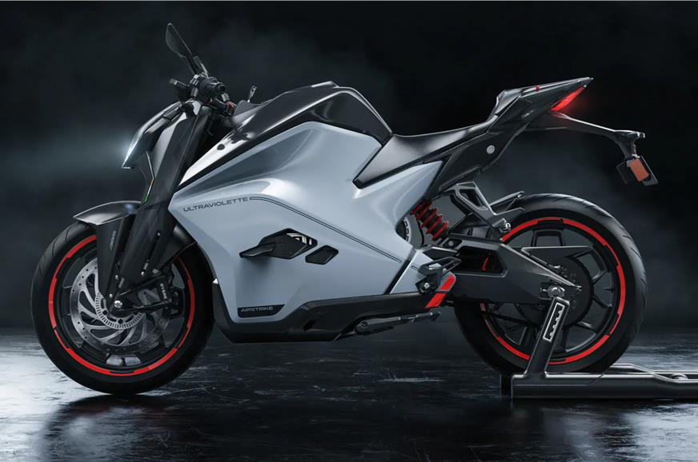
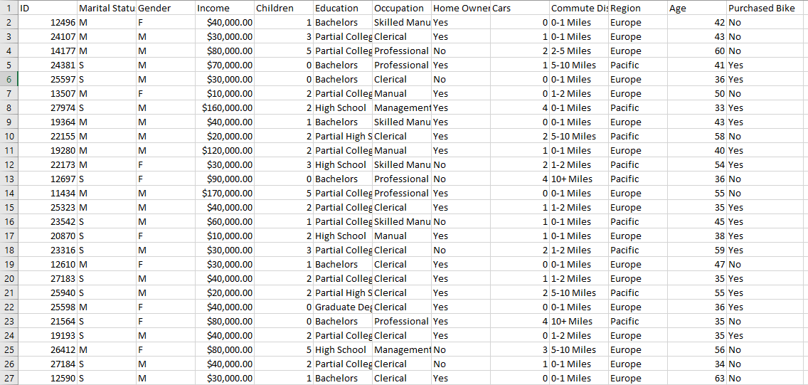
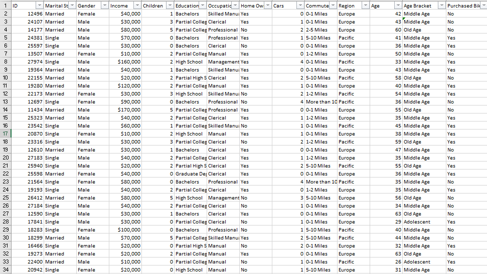
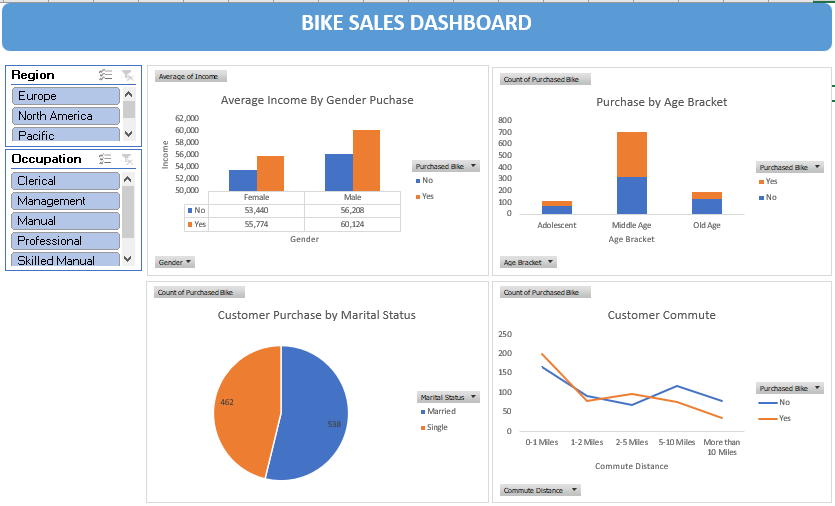

## Analysis of Bikes Sales Data

## Table of Contents:

- Introduction
- Problem Statement
- Data Collection
- Data Cleaning and Preparation
- Insights
- Recommendations

## Introduction:
In the dynamic world of retail, understanding customer preferences and market trends is essential for success. The "Bike Sales Analysis" project sets out to explore valuable insights hidden within the dataset. Using Microsoft Excel, this analysis aims to provide retailers with a deeper understanding of their customer base, popular bike types, and factors influencing purchase decisions.

## Problem Statement:
In the competitive landscape of bike sales, understanding customer demographics, purchasing behavior, and factors influencing their decisions is crucial for optimizing marketing strategies and inventory management. To address this challenge, the "Bike Sales Analysis" project aims to explore the following key aspects:
- Average Income by Gender for Bike Buyers and Non-Bike Buyers: This insight will guide gender-specific marketing efforts.
- Purchase by Age Bracket: Understanding which age groups contribute the most to bike purchases is essential.
- Customer Commute Behavior Over Time: By tracking the trends in customers who use bikes for commuting and those who do not, we can identify changing behaviors and adapt our strategies accordingly.
- Customer Purchase by Marital Status: Analyzing bike purchases based on marital status is important for targeted marketing campaign.

  The analysis was filtred by region and occupation to gain more understanding.

## Data Cleaning and Exploratory Data Analysis (EDA)
This Excel project revolves around the analysis of a bike sales dataset obtained from this link: (https://github.com/AlexTheAnalyst/Excel-Tutorial/blob/main/Excel%20Project%20Dataset.xlsx). The dataset contains information about bike sales, including various attributes such as ID, Marital Status, Gender, Income, Children, Education, Occupation, Home Owner, Cars, Commute Distance, Region, Age, and whether a bike was purchased or not.

# Data Cleaning:
- The first step involved identifying and removing duplicate rows from the dataset. This was achieved by selecting the entire dataset, going to the "Data" tab, and using the "Remove Duplicates" feature. A total of 26 duplicate values were identified and removed.
- Standardizing Categorical Data: The "Marital Status" and "Gender" columns contained abbreviations 'M' and 'S'. These abbreviations were replaced with 'Married' and 'Single' for "Marital Status" and 'Male' and 'Female' for "Gender" using the "Find and Replace" functionality.
- Outlier Detection: To identify outliers in the "Income" column, a boxplot was created. The boxplot did not reveal any significant outliers, indicating that the income data is within a reasonable range.

  # Before Cleaning                        
                   

# After Cleaning

# Exploratory Data Analysis (EDA):
- Age Distribution Analysis: A histogram was created to visualize the distribution of ages among customers. To enhance clarity, an additional "Age Category" column was added, categorizing ages into "Adolescent," "Middle Age," and "Old" using Excel's IF statement.
- Several Pivot tables and charts were created to explore factors influencing bike sales:

1) Average Income by Gender for Bike Buyers and Non-Bike Buyers: A bar chart was generated to compare the average income of male and female customers who either purchased bikes or did not.
2) Bike Purchases by Age Bracket: A bar chart displayed the distribution of bike purchases among different age brackets.
3) Bike Purchases by Commute Distance: A dynamic line chart illustrated the relationship between commute distance and bike purchases.
4) Customer Purchase by Marital Status: A pie chart was used to analyze bike purchases based on marital status for targeted marketing campaigns

# Dashboard

# Insights
- Gender Influence: Across all regions and occupations, males consistently have a stronger presence in bike purchases.
- Marital Status Impact: Marital status plays a role in bike purchase behavior, with both married and single individuals showing interest, though the balance varies by region.
- Age Group Preferences: Middle-aged customers consistently show a higher propensity for bike purchases across regions and occupations.
- Occupational Variances: Different occupational groups have varying preferences for bike purchases, suggesting the need for tailored marketing strategies.
- Regional Nuances: While common trends exist, regional nuances are observed, such as the preference for singles in Europe, highlighting the importance of localized marketing.

# Recommendations:

- Targeted Marketing Strategies: Tailor marketing campaigns to specific demographics based on the insights gathered from both region and occupation analysis. Create personalized messages and promotions to resonate with different customer segments.
- Regional Customization: Recognize the regional nuances in bike purchase behavior. Customize product offerings and marketing approaches to align with the preferences of each region. For example, in Europe, consider campaigns targeting middle-aged singles, while in North America, focus on middle-aged married individuals.
- Occupation-Centric Campaigns: Develop marketing campaigns that cater to different occupational groups. Highlight how bikes can meet the specific needs of professionals, managers, clerical workers, manual laborers, and skilled manual workers.
- Marital Status Consideration: Acknowledge the influence of marital status on bike purchases. Create promotions that appeal to both married and single customers. For example, offer family-friendly packages for married couples and single-commuter deals.
- Age-Appropriate Messaging: Craft messages that resonate with the dominant age group in each region and occupation. Emphasize the benefits of biking for daily commuting, leisure, fitness, or eco-friendly transportation, depending on the age category.
- Product Diversification: Consider diversifying the range of bikes and accessories to cater to different customer preferences. Offer options suitable for various uses, such as commuting, recreational riding, or sports.

# Conclusion:

In conclusion, the analysis of bike purchase behavior based on both region and occupation has provided valuable insights into the diverse preferences of customers. It's evident that gender, marital status, age, and occupation play crucial roles in influencing bike purchase decisions.

The data has revealed common trends, such as the prominence of middle-aged customers in bike purchases across regions and occupations, and regional variations, like the preference for singles in Europe. Understanding these nuances is essential for businesses to develop effective marketing strategies and product offerings.

